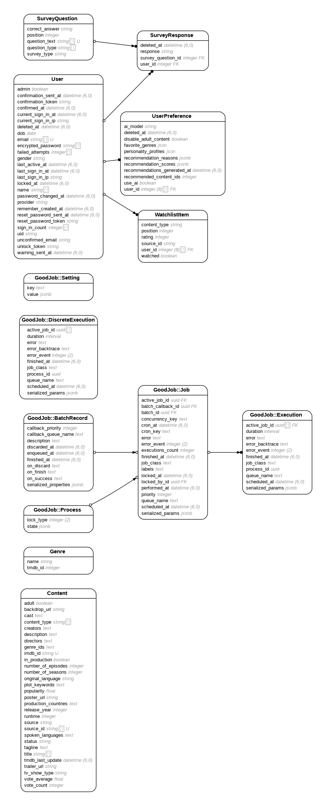

# CineMatch

## Description

CineMatch is a personalized content recommendation platform that matches feature films and episodic content to users' preferences and personality traits. By leveraging a combination of psychological profiling and preference surveys, CineMatch aims to provide highly tailored content recommendations.

## Table of Contents

- [CineMatch](#cinematch)
  - [Description](#description)
  - [Table of Contents](#table-of-contents)
  - [Instructions](#instructions)
    - [Configuration](#configuration)
    - [Installation](#installation)
  - [Usage](#usage)
  - [Contributing](#contributing)
  - [ERD](#erd)
  - [User Journey](#user-journey)
  - [License](#license)
  - [Contacts](#contacts)


## Instructions

### Configuration

- Cinematch uses TMDB API to fetch content data, so launching the app requires setting up API key as `THEMOVIEDB_KEY` in the environment variables. [Details on TMDB API](https://developer.themoviedb.org/docs/getting-started).
- Password recovery functionality requires configuring external SMTP server for mailer in `development.rb` or `production.rb` (depending on the environment) and providing its credentials in the environment variables as `SMTP_USERNAME` and `SMTP_PASSWORD`. Currently, Cinematch uses Zoho SMTP server as default.

### Installation

1. Clone the repository:
```bash
git clone https://github.com/aborov/cinematch.git
```
2. Navigate to the project directory:
```bash
cd cinematch
```
3. Install the required gems:
```bash
bundle install
```
4. Set up the database:
```bash
rails db:setup
```
<!-- `rails db:setup` already includes `rails db:seed`, so step 5 is redundant -->
5. Set up the survey questions:
```bash
rails db:seed
```
6. Start the Rails server:
```bash
rails server
```

## Usage

1. Start the Rails server:
```bash
rails server
```
2. Open your browser and navigate to http://localhost:3000.
3. Sign up or log in to your account.
4. Complete the initial setup survey to input your personality traits and favorite genres. (For an existing account where the survey has been already taken, click Profile icon in the right top corner to go to Profile dashboard, then press "Retake Personality Survey" under Personality Profile tab.)  
5. Browse the personalized content recommendations on the main screen.
6. Click on any recommended title to view detailed information.
7. To make changes to account data or refine the recommendation results, click Profile icon in the right top corner to go to the Profile dashboard).

## Contributing

Contributions are welcome! Please follow these guidelines:

1. Find an issue or idea to work on in the [Project tab](https://github.com/users/aborov/projects/1).
2. Fork the repository.
3. Create a new branch:
```bash
git checkout -b branch-name
```
Please use the following naming conventions for your branches:
- `<issue#-initals-description>` (i.e. 31-mcw-added-pagination)
4. Commit your changes:
```bash
git commit -m 'Add some feature'
```
5. Push to the branch:
```bash
git push origin branch-name
```
6. Open a pull request with detailed description, referencing the issue it addresses.

**Coding Conventions**

Please follow the [Ruby community Style Guide](https://rubystyle.guide/).

**Naming Conventions**

  - Use `snake_case` for variables, methods, and file names.
  - Use `PascalCase` for class and module names.
  - Reflect domain concepts accurately in naming. For instance, if you are working within a financial application, prefer names like `user_account_details` over vague terms like `data`.

**Design Principles**: Focus on Domain-Driven Design (DDD)
  - Organize code to reflect the domain model clearly.
  - Use service objects, decorators, and other design patterns that help isolate domain logic from application logic.

**Comments and Documentation**
- Comment your code where necessary to explain "why" something is done, not "what" is done—source code should be self-explanatory regarding the "what".
- Document methods and classes thoroughly, focusing on their roles within the domain model, especially for public APIs.

**Version Control Practices**
- Commit messages should be clear and follow best practices, such as those outlined in [How to Write a Git Commit Message](https://chris.beams.io/posts/git-commit/).
- Keep commits focused on a single issue to simplify future maintenance and troubleshooting.

## ERD


## User Journey


## License

Distributed under the GNU General Public License (GPL). See `LICENSE` for more information.

## Contacts

- For user inquiries: info@cinematch.net
- For development inquiries: Aleksei Borovikov alex@aborovikov.com
- [Project Link](https://github.com/users/aborov/projects/1)
- [Application Link](https://cinematch.net)
